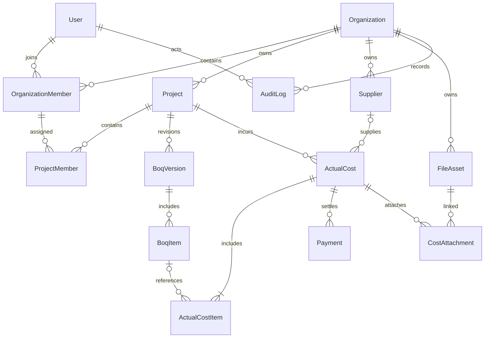

# โครงสร้างข้อมูลรุ่นแรก

## ERD

## ชนิดข้อมูลร่วม

- ID: string แบบ cuid ตามฐานเดิม, ไม่ใช้เลขลำดับเป็นสิทธิ์เข้าถึง; ID ตัวอย่างในเอกสารเป็นค่าจำลอง
- เงินสรุป: Decimal(18,2); quantity/unit price: Decimal(18,4); vatRate: Decimal(7,6) ในรูปสัดส่วน เช่น `0.070000`
- amount ที่ API ต้องเป็น string ฐานสิบ ไม่มี comma/exponent; ห้ามคำนวณเงินด้วย Number แบบ floating point
- วันที่ธุรกิจ: DATE และส่ง `YYYY-MM-DD`; เวลาเหตุการณ์: UTC datetime และส่ง ISO-8601; จัดกลุ่มวัน/เดือนตาม Asia/Bangkok
- mutable entity มี `version Int default 1`, `createdAt`, `updatedAt`, `createdByUserId`; update ต้องเปรียบเทียบ version
- ข้อความ trim ก่อนตรวจ; Unicode; name ไม่เกิน 200, description/note ไม่เกิน 2,000; ID/code ไม่เกิน 191
- Status/role/category เป็น enum ค่าตัวพิมพ์ใหญ่; import เดิมมี mapper จาก lowercase ไม่แก้ค่าต้นฉบับ

## Data dictionary

| Entity | Fields หลักเพิ่มเติมจาก ID/เวลา | Constraints |
|---|---|---|
| User | email, displayName, status, googleId และ auth fields เดิม | email normalize lowercase unique; ตัวตนร่วมหลายองค์กร |
| Organization | name, code, status ACTIVE/SUSPENDED, currency THB, timezone Asia/Bangkok, defaultVatRate | code unique; defaultVatRate ไม่เปลี่ยนเอกสารเก่า |
| OrganizationMember | organizationId, userId, role OWNER/ACCOUNTANT/MEMBER, status ACTIVE/SUSPENDED, version | unique(org,user); อย่างน้อยหนึ่ง active OWNER |
| Project | organizationId, code, name, clientName, clientContact?, location?, startDate?, endDate?, status, contractNet?, contractVatRate?, contractVat?, contractGross?, currentBaselineId?, version | unique(org,code), unique(org,id); เงินสัญญาทั้งชุด null ได้ก่อนมีข้อตกลง; ชุดค่าต้องครบเมื่อมีสัญญา |
| ProjectMember | organizationId, projectId, organizationMemberId, role MANAGER/RECORDER/VIEWER, canReadCosts default false, status ACTIVE/SUSPENDED, version | unique(project,member); organization ทั้งสามต้องตรง; canReadCosts ใช้เฉพาะ VIEWER |
| Supplier | organizationId, name, taxId?, contactName?, telephone?, email?, address?, status ACTIVE/ARCHIVED, version | unique(org,id); taxId เป็น string ไม่ตรวจ unique ทั้งระบบ; เก็บ snapshot ในเอกสาร |
| BoqVersion | organizationId, projectId, revision, status DRAFT/APPROVED/SUPERSEDED, totalEstimatedCost, approvedAt?, approvedByUserId?, version | unique(project,revision); currentBaselineId ต้องชี้ approved ของ project เดียวกัน |
| BoqItem | organizationId, projectId, boqVersionId, position, category, description, unit, quantity, estimatedUnitCost, total | unique(version,position); quantity > 0, unit cost >= 0; approved item immutable |
| ActualCost | organizationId, projectId, supplierId?, supplierNameSnapshot?, supplierTaxIdSnapshot?, documentNo?, documentDate, dueDate?, status DRAFT/POSTED/VOID, vatMode, vatRate, netAmount, vatAmount, grossAmount, source MANUAL/AI_RECEIPT_SCAN/IMPORT, replacesCostId?, postedAt?, postedByUserId?, voidReason?, version | posted ต้องมีอย่างน้อย 1 item และ gross > 0; replacement อยู่ project เดิมและอ้างเอกสาร VOID |
| ActualCostItem | organizationId, projectId, actualCostId, position, category, description, unit?, quantity, unitPrice, enteredAmount, netAmount, vatAmount, grossAmount, boqItemId? | quantity > 0, unitPrice >= 0; BOQ item อยู่ project เดียวกัน แม้เป็น revision เก่า |
| Payment | organizationId, projectId, actualCostId, amount, paidDate, method CASH/BANK_TRANSFER/OTHER, reference?, status POSTED/REVERSED, reversedAt?, reversedByUserId?, reverseReason?, version | amount > 0; sum ของ POSTED ไม่เกิน gross; วันจ่ายไม่เกินวันที่ปัจจุบัน |
| FileAsset | organizationId, storageKey, originalName, mimeType, byteSize, checksum, status PENDING/READY/DELETED, uploadedByUserId | private; random key ไม่ใช้ชื่อผู้ใช้อัปโหลดเป็น path; record ที่ถูกอ้างอิงยังลบทิ้งไม่ได้ |
| CostAttachment | organizationId, projectId, actualCostId, fileAssetId | unique(cost,file); file org ตรง; อ่านผ่านสิทธิ์ cost ไม่ใช่เดา file ID |
| AuditLog | organizationId, projectId?, actorUserId, action, entityType, entityId, occurredAt, requestId, changes Json | append-only; allow-list fields; ไม่มี token/secret/ไฟล์ทั้งก้อน |

Invoice ไม่ระบุ supplier ได้สำหรับรายจ่ายเบ็ดเตล็ด แต่ไม่สร้าง supplier ปลอมมาเติม การมี supplier ไม่ได้ให้อ่านต้นทุนทุก project ที่ใช้ supplier นั้น

## Invariants ที่ต้องบังคับใน DB และ service

1. ทุก entity ธุรกิจมี organizationId; สร้าง unique(org,id) ใน entity ที่จะถูกอ้างด้วย composite FK
2. ใช้ composite FK `(organizationId,projectId)` → Project; ProjectMember เชื่อมสมาชิกด้วย `(organizationId,organizationMemberId)` → OrganizationMember
3. child ของ cost/BOQ/payment ใช้ FK ที่รักษา org/project ตรงกัน ตรวจละเอียดใน transaction เพิ่มจาก FK
4. ห้าม cascade-delete เงินและ audit; parent ใช้ RESTRICT/archival; ห้ามลบผู้ใช้ที่มีประวัติธุรกิจจนประเมิน retention
5. การเปลี่ยน owner, baseline, post/void และ payment ต้อง transaction รวม audit; concurrent mutation ล็อก parent ที่เกี่ยวข้องและตรวจ version
6. role จาก token ใช้ระบุตัวตนเท่านั้น การอนุญาตทางธุรกิจอ่าน User/Membership/ProjectMember ปัจจุบัน
7. ไม่เก็บ paymentStatus/overdue เป็นสถานะให้ผู้ใช้แก้เอง; derive จากยอด Payment, dueDate และ asOfDate
8. ไม่มี baseline/contract เป็น null ไม่ใช้ 0 เพื่อแทนข้อมูลที่ยังไม่ทราบ
9. Defaultหมวด: MATERIALS, LABOR, MACHINERY, SUBCONTRACTOR, TRANSPORTATION, DESIGN, SERVICES, OTHER; เปลี่ยนข้อความแสดงผลได้โดยไม่เปลี่ยน code

## สูตรและการปัดเศษ

`enteredAmount` ของแต่ละรายการ = roundHalfUp(quantity × unitPrice, 2) แล้วรวมเป็นยอดเอกสาร

- VAT_EXCLUDED: net = sum(enteredAmount); VAT = round(net × rate,2); gross = net + VAT
- VAT_INCLUDED: gross = sum(enteredAmount); net = round(gross / (1 + rate),2); VAT = gross − net
- NON_VAT: net = gross = sum(enteredAmount); VAT = 0 และ rate = 0
- แจก net/VAT ไป line ด้วยสัดส่วน enteredAmount: floor เป็นสตางค์ก่อน แล้วแจกเศษให้ fractional remainder มากที่สุด ผูกอันดับด้วย position จากน้อยไปมาก; ทุก line net+VAT=gross และผลรวมตรง document
- ต้นทุนบริหารใช้ net; NON_VAT ใช้ยอดเต็ม; หากกิจการต้องรวม VAT บางส่วนเป็นต้นทุน ต้องเพิ่มกติกาแยกก่อนใช้กรณีนั้นจริง
- paid = sum(POSTED payments); outstanding = gross − paid; overdue = outstanding > 0 AND dueDate < asOfDate
- actualNet = sum(net ของ POSTED cost); baselineRemaining = baseline − actualNet; contractLessActual = contractNet − actualNet
- ชื่อหน้าจอใช้ “ส่วนต่างสัญญากับต้นทุนปัจจุบัน”; ไม่สื่อว่าเป็นเงินสดคงเหลือหรือกำไรสุดท้าย
- Markup 20%: cost×1.20; margin 20%: cost÷0.80; margin >= 100% ปฏิเสธ

ตัวเลข VAT ใน reference เป็นค่าทดสอบทางคณิตศาสตร์ ไม่กำหนดอัตราภาษีจริงให้กิจการ

## แผนเปลี่ยนจาก schema ตั้งต้น

ระยะ 2 เพิ่มเฉพาะ Organization/Member/Project/ProjectMember/Supplier/AuditLog ส่วนโมเดลเงินสร้างในระยะที่รับผิดชอบ

ไม่แก้ initial migration ที่อาจถูกใช้งานไปแล้ว เพิ่ม migration ใหม่และตรวจสถานะ DB ก่อนใช้เสมอ ถ้ามี User เดิม ให้ bootstrap องค์กรและ map membership แบบ explicit ไม่ตีความ SUPERADMIN ว่าเป็น OWNER ทุกองค์กร

เพิ่ม relation ก่อน → backfill สมาชิกของฐานที่มีข้อมูลด้วย mapping ที่ตรวจแล้ว → ย้าย current-user DTO/guards ออกจาก User.company/role → ถอด enum/field เดิมด้วย migration ถัดไปเมื่อไม่มี consumer

สำหรับฐานว่างใช้ bootstrap CLI แบบครั้งเดียวสร้างองค์กรและ OWNER พร้อม transaction; CLI ไม่ส่งอีเมล ไม่สมัคร Google แทนผู้ใช้ และรันซ้ำไม่สร้างซ้ำ
